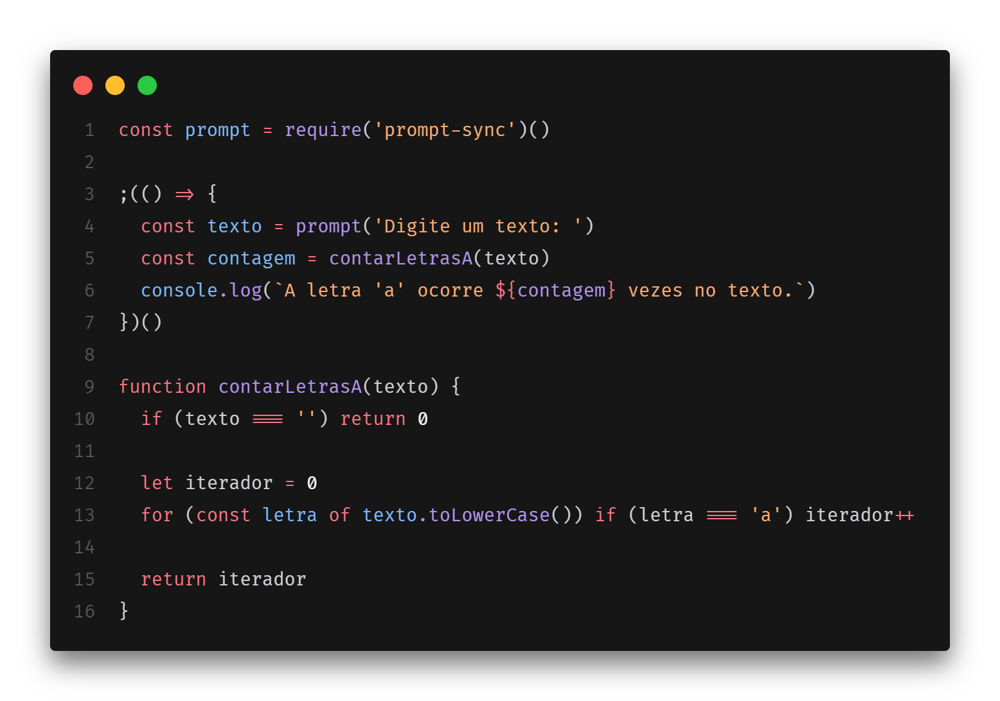

# [Desafio] Target Sistemas - Estágio em Desenvolvimento

## 1. Descobrir se um número pertence a sequência de fibonacci 🌀

### Enunciado exercício 1

Dado a sequência de Fibonacci, onde se inicia por 0 e 1 e o próximo valor sempre será a soma dos 2 valores anteriores (exemplo: 0, 1, 1, 2, 3, 5, 8, 13, 21, 34...), escreva um programa na linguagem que desejar onde, informado um número, ele calcule a sequência de Fibonacci e retorne uma mensagem avisando se o número informado pertence ou não a sequência.

IMPORTANTE: Esse número pode ser informado através de qualquer entrada de sua preferência ou pode ser previamente definido no código.

### Solução exercício 1

[Clique aqui](./exercicios/exercicio1.js) para ver o código.


## 2. Verificar a existência e quantidade de letras "a" em uma string 🅰️

### Enunciado exercício 2

Escreva um programa que verifique, em uma string, a existência da letra ‘a’, seja maiúscula ou minúscula, além de informar a quantidade de vezes em que ela ocorre.

IMPORTANTE: Essa string pode ser informada através de qualquer entrada de sua preferência ou pode ser previamente definida no código.

### Solução exercício 2

[Clique aqui](./exercicios/exercicio2.js) para ver o código.


## 3. Identificar o valor final da variável SOMA ➕

### Enunciado exercício 3

Observe o trecho de código abaixo: int INDICE = 12, SOMA = 0, K = 1; enquanto K < INDICE faça { K = K + 1; SOMA = SOMA + K; } imprimir(SOMA);

Ao final do processamento, qual será o valor da variável SOMA?

### Solução exercício 3

Trecho do código fornecido:

```ts
int INDICE = 12, SOMA = 0, K = 1;

enquanto K < INDICE faça {
  K = K + 1;
  SOMA = SOMA + K;
}

imprimir(SOMA);
```

Resultado é 77, pois é feito a alteração do K para 12 e a soma antes da comparação de `K < INDICE`.

| INDICE | K   | SOMA | K < INDICE |
| ------ | --- | ---- | ---------- |
| 12     | 1   | 0    | TRUE       |
| 12     | 2   | 2    | TRUE       |
| 12     | 3   | 5    | TRUE       |
| 12     | 4   | 9    | TRUE       |
| 12     | 5   | 14   | TRUE       |
| 12     | 6   | 20   | TRUE       |
| 12     | 7   | 27   | TRUE       |
| 12     | 8   | 35   | TRUE       |
| 12     | 9   | 44   | TRUE       |
| 12     | 10  | 54   | TRUE       |
| 12     | 11  | 65   | TRUE       |
| 12     | 12  | 77   | FALSE      |

## 4. Descubra os próximos elementos 🕵🏻

### Enunciado exercício 4

Descubra a lógica e complete o próximo elemento:

a) 1, 3, 5, 7, \_\_\_

b) 2, 4, 8, 16, 32, 64, \_\_\_\_

c) 0, 1, 4, 9, 16, 25, 36, \_\_\_\_

d) 4, 16, 36, 64, \_\_\_\_

e) 1, 1, 2, 3, 5, 8, \_\_\_\_

f) 2, 10, 12, 16, 17, 18, 19, \_\_\_\_

### Solução exercício 4

a) 9, pulando de 2 em 2.

b) 128, dobro do número anterior.

c) 49, números inteiros elevado a 2.

d) 100, números inteiros pares elevado a 2.

e) 13, sequência de fibonacci.

f) 200, acredito que seja número que começam a letra "D".

## 5. Qual lâmpada pertence a qual interruptor 💡

### Enunciado exercício 5

Você está em uma sala com três interruptores, cada um conectado a uma lâmpada em salas diferentes. Você não pode ver as lâmpadas da sala em que está, mas pode ligar e desligar os interruptores quantas vezes quiser. Seu objetivo é descobrir qual interruptor controla qual lâmpada. Como você faria para descobrir, usando apenas duas idas até uma das salas das lâmpadas, qual interruptor controla cada lâmpada?

### Solução exercício 5

Primeiramente, ligaria um interruptor e aguardaria tempo suficiente para a lampada aquecer, após esse tempo, desligaria esse interruptor e ligaria outro, após isso iria em duas das salas verificar as lampadas:

- Se a lampada estivesse ligada, saberia que pertence ao segundo interruptor ligado.
- Se a lampada estivesse desligada e aquecida, saberia que pertence ao primeiro interruptor ligado.
- Se a lampa estivesse desligada e fria, saberia que pertence ao interruptor que não foi ligado.
