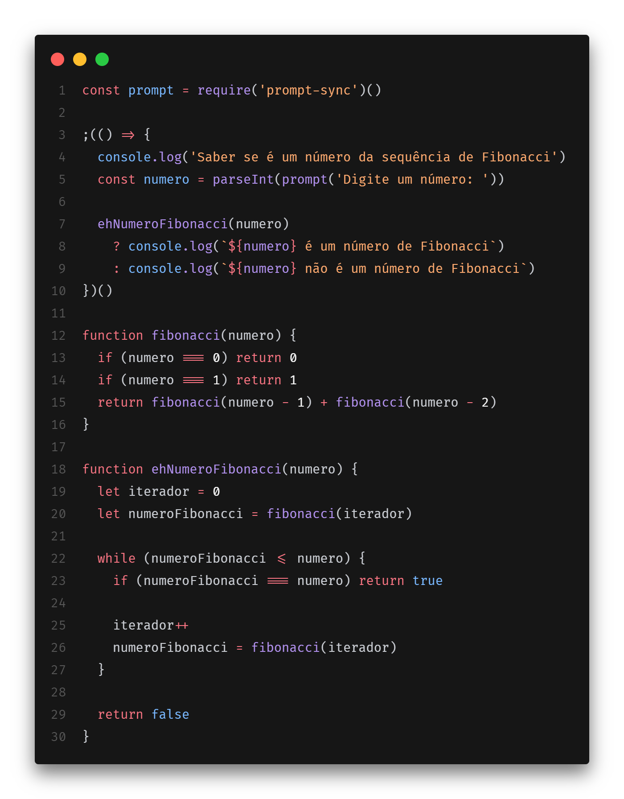

# [Desafio] Target Sistemas - Estágio em Desenvolvimento

## 1. Descobrir se um número pertence a sequência de Fibonacci 🌀

### Enunciado

Dado a sequência de Fibonacci, onde se inicia por 0 e 1 e o próximo valor sempre será a soma dos 2 valores anteriores (exemplo: 0, 1, 1, 2, 3, 5, 8, 13, 21, 34...), escreva um programa na linguagem que desejar onde, informado um número, ele calcule a sequência de Fibonacci e retorne uma mensagem avisando se o número informado pertence ou não a sequência.

IMPORTANTE: Esse número pode ser informado através de qualquer entrada de sua preferência ou pode ser previamente definido no código.

### Solução

[Clique aqui](./exercicios/exercicio1.js) para ver o código.

